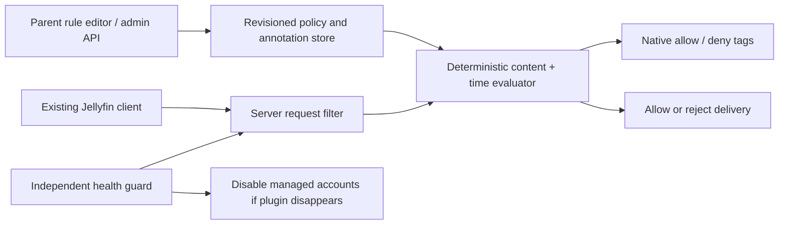

# Family Policy for Jellyfin

**Give children room to explore within boundaries you choose.**

Family Policy adds administrator-managed content rules, individual exceptions,
and viewing hours to Jellyfin. Start with “PG or lower”, then allow unrated soccer,
a franchise you trust, or workout videos before normal viewing hours.

**Experimental preview.** Native-server and browser acceptance tests passed on unmodified Jellyfin 12.1 and
12.2 against
disposable data. Real Apple TV/iPhone household validation is still pending.
Read [installation](docs/installation.md) and [security boundaries](SECURITY.md)
before a staging pilot. This is a community project, not an official Jellyfin plugin.

Maintained by **[Anthem Flynn](https://github.com/AnthemFlynn)**.
Derived from [TIGamingTV/JellyPrivateLibraries](https://github.com/TIGamingTV/JellyPrivateLibraries),
with original attribution and MIT license preserved. The maintained adapter has
its own identity; upstream's self-service plugin is not included in release artifacts.

## What you can express

| Rule | Behavior |
| --- | --- |
| PG / TV-PG or lower | Simple default content preset |
| Unrated **and** parent-confirmed Soccer subject | Subject exception without opening all unrated content |
| Parent-confirmed Star Wars franchise | Franchise allowance independent of the default rating ceiling |
| Block a particular movie or episode | Individual decision wins at the configured priority |
| 08:00–18:00 viewing hours | Independent time permission, using the server clock and policy timezone |
| Workout category before 08:00 | Morning exception; content restrictions still apply |
| Age band plus rating ceiling | Configured age threshold; no birthday data or silent progression |

Rules support All, Any, Not, priorities, hard blocks and expiry. Deny wins a tied
priority. Unknown conditions cannot grant exceptions; an unknown deny condition
blocks at its configured priority. Preview explains which rules determined access.

Subject, category and franchise labels are **parent-confirmed annotations**, not
imported tags. External metadata/NFO files or AI suggestions cannot grant access.
A confirmed series label or title grant covers descendants; an episode override
can be narrower. Stable local title IDs are used in this preview; automatic
provider-ID rematching after a replacement is not yet implemented.

## How it works



The plugin uses Jellyfin extension points; no server source rewrite is required.
Native tags provide browsing visibility, while request-time checks enforce current
policy. An independent guard is required before enrolling managed accounts.

At a cutoff, the server rejects new playback, aborts ongoing responses and attempts
a client Stop. **Already-buffered or offline media cannot be recalled.** Some
unauthenticated legacy stream routes are intentionally unsupported. See
[compatibility and validation](docs/testing.md).

## Build and test

Requires the exact .NET SDK in `global.json`.

```sh
dotnet restore tests/FamilyPolicy.Core.Tests/FamilyPolicy.Core.Tests.csproj --locked-mode
dotnet test tests/FamilyPolicy.Core.Tests/FamilyPolicy.Core.Tests.csproj -c Release --no-restore
dotnet restore src/FamilyPolicy.Plugin/FamilyPolicy.Plugin.csproj --locked-mode
dotnet build src/FamilyPolicy.Plugin/FamilyPolicy.Plugin.csproj -c Release --no-restore
dotnet restore src/FamilyPolicy.Guard/FamilyPolicy.Guard.csproj --locked-mode
dotnet build src/FamilyPolicy.Guard/FamilyPolicy.Guard.csproj -c Release --no-restore
```

[Native integration and browser tests](docs/testing.md) generate their own media
and synthetic accounts. [Development plan](DEVELOPMENT-PLAN.md),
[architecture decisions](docs/decisions/0001-enforcement-and-label-provenance.md),
[API reference](docs/api.md) and [contributing](CONTRIBUTING.md) explain the contract.

## Project status

- Implemented: policy core, parent-only API, PG preset/advanced rule editor,
  confirmed labels, preview, native content enforcement, schedule filter,
  independent guard, original-policy restoration and bounded revision audit.
- Tested locally: 28 core behavioral cases; two synthetic child identities; native file/HLS
  delivery; series/episode precedence; native timed file cutoff; guard recovery;
  real Chromium editor with the native API (ApiClient compatibility shim).
- Pending: real Jellyfin web-shell/device pilot, broader route/security review,
  Seerr integration, provider rematching, large-library performance measurements.

The public repository is a reviewable preview; it does not advertise production
readiness or untested compatibility. See [release notes](CHANGELOG.md).
